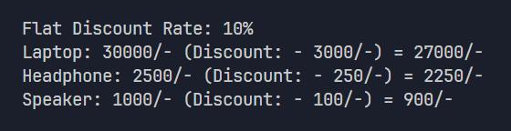
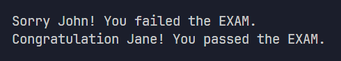
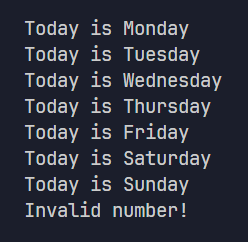
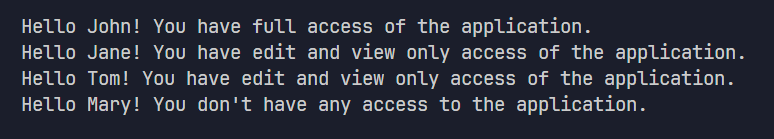
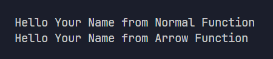
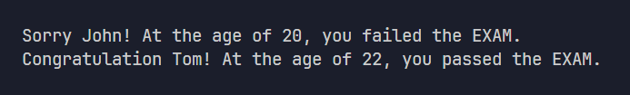
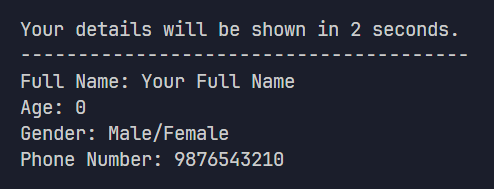
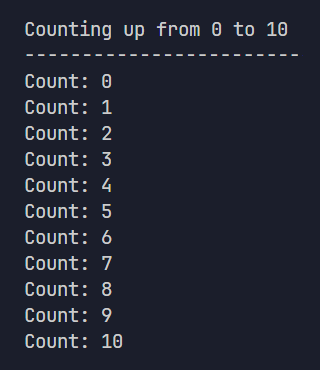
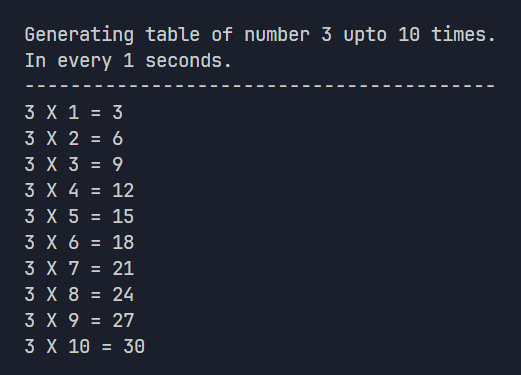

# TypeScript Practicals

A comprehensive collection of TypeScript exercises covering fundamental programming concepts, data structures, functions, and advanced features.

## Practical 1

Create variables named "fullName", "age", "gender", and "phoneNumber" with sample values.
Then display each variable's value in the console using console.log().

### Steps:

1. Create four variables to store personal information:
   - fullName: stores a person's full name
   - age: stores a person's age
   - gender: stores a person's gender
   - phoneNumber: stores a person's phone number

2. Display each variable's value in the console using console.log()
   This will print the values to the terminal when the program runs.

### Preview:

---

## Practical 2

Create variables named "fullName", "age", "gender", and "phoneNumber" with sample values.
Then display each variable's value in the console using template strings with descriptive labels.

### Steps:

1. Create four variables to store personal information:
   - fullName: stores a person's full name
   - age: stores a person's age
   - gender: stores a person's gender
   - phoneNumber: stores a person's phone number

2. Use template strings (backticks ``) to display each variable with a descriptive label
   Template strings allow you to embed variables directly using ${variableName}
   This will print formatted output like "Full Name: John Doe" to the terminal.

### Preview:

---

## Practical 3

Create an array named "userArray" to store personal information.
Store "fullName", "age", "gender", and "phoneNumber" in the array.
Then display each value using array indexing with template strings.

### Steps:

1. Create an array called userArray to store all personal information:
   - Index 0: stores the person's full name
   - Index 1: stores the person's age
   - Index 2: stores the person's gender
   - Index 3: stores the person's phone number

2. Access array elements using square brackets array[index]
   Arrays are zero-indexed, meaning the first element is at index 0

3. Use template strings to display each value with descriptive labels
   This will print formatted output like "Full Name: John Doe" to the terminal.

### Preview:

---

## Practical 4

Create an object named "userObject" to store personal information as key-value pairs.
Store "fullName", "age", "gender", and "phoneNumber" as properties of the object.
Then display each value using dot notation with template strings.

### Steps:

1. Create an object called userObject with properties:
   - fullName: stores the person's full name
   - age: stores the person's age
   - gender: stores the person's gender
   - phoneNumber: stores the person's phone number

2. Access object properties using dot notation (object.property)
   This is the most common way to access object properties in JavaScript/TypeScript

3. Use template strings to display each value with descriptive labels
   This will print formatted output like "Full Name: John Doe" to the terminal.

### Preview:

---

## Practical 5

Create a multiplication table (1 to 10) using a variable to store the base number.
The table will be automatically calculated based on the number variable.
Display the formatted multiplication table in the terminal.

### Steps:

1. Create a variable called "number" to store the base number for the multiplication table
   This variable determines which multiplication table to generate (e.g., 2 for 2's table)

2. Generate multiplication table from 1 to 10:
   - Multiply the base number by each number from 1 to 10
   - Use template strings to format each line as "2 X 1 = 2"

3. Display each multiplication result using console.log()
   This will print a complete multiplication table to the terminal
   The output format will be: "number X multiplier = result"

### Preview:

---

## Practical 6

Create a Discount Percentage Calculator to calculate discounts on multiple products.
Use variables to store the discount rate and product prices.
Based on the discount rate, calculate the discount amount for each product.
Display the formatted results in the terminal.

### Steps:

1. Create variables for discount calculation:
   - discount: stores the discount percentage (e.g., 10 for 10%)
   - laptopPrice: stores the original price of laptop
   - headphonePrice: stores the original price of headphone
   - speakerPrice: stores the original price of speaker

2. Calculate discount amount for each product:
   - Formula: discountAmount = (productPrice \* discount) / 100
   - This calculates how much money will be discounted from each product

3. Display results using template strings:
   - Show the flat discount rate first
   - For each product: show original price and calculated discount amount
   - Format: "Product: price/- (Discount: - discountAmount/-)"

### Preview:

---

## Practical 7

Create an Enhanced Discount Percentage Calculator to calculate discounts and final prices.
Use variables to store the discount rate and product prices.
Based on the discount rate, calculate both the discount amount and the final price after discount.
Display the formatted results with original price, discount amount, and final price.

### Steps:

1. Create variables for discount calculation:
   - discount: stores the discount percentage (e.g., 10 for 10%)
   - laptopPrice: stores the original price of laptop
   - headphonePrice: stores the original price of headphone
   - speakerPrice: stores the original price of speaker

2. Calculate discount amount and final price for each product:
   - Discount Formula: discountAmount = (productPrice \* discount) / 100
   - Final Price Formula: finalPrice = productPrice - discountAmount
   - This calculates both how much is discounted and the final price to pay

3. Display results using template strings:
   - Show the flat discount rate first
   - For each product: show original price, discount amount, and final price
   - Format: "Product: price/- (Discount: - discountAmount/-) = finalPrice/-"

### Preview:

---

## Practical 8

Create a Student Grade Calculator to determine pass/fail status based on marks.
Use an object to store student name and mark.
Based on the student mark, calculate the grade as pass or fail using conditional logic.
Use 35 as the passing mark threshold.
Display the result in the terminal with a personalized message.

### Steps:

1. Create a student object with properties:
   - name: stores the student's name
   - mark: stores the student's exam mark

2. Use conditional logic (if-else statement) to determine pass/fail:
   - Check if student.mark is greater than or equal to 35
   - If mark >= 35: student passed the exam
   - If mark < 35: student failed the exam

3. Display the result using template strings:
   - Show a personalized message with the student's name
   - Display either congratulations or sorry message based on the result
   - Format: "Congratulation [name]! You passed the EXAM." or "Sorry [name]! You failed the EXAM."

### Preview:

---

## Practical 9

Create a Day Name Converter to display the day name based on a number.
Use a variable to store a number from 1 to 7.
Based on the number, display the corresponding day name using a switch statement.
For invalid numbers (not 1-7), show an invalid message.
Display the result in the terminal.

### Steps:

1. Create a variable called dayNumber:
   - Stores a number from 1 to 7 representing days of the week
   - 1 = Monday, 2 = Tuesday, ..., 7 = Sunday

2. Use a switch statement to match the dayNumber with the correct day:
   - case 1: Monday
   - case 2: Tuesday
   - case 3: Wednesday
   - case 4: Thursday
   - case 5: Friday
   - case 6: Saturday
   - case 7: Sunday
   - Each case needs a break statement to exit the switch

3. Use the default case for invalid numbers:
   - Handles any number not between 1-7
   - Displays "Invalid number!" message

4. Display the result using console.log():
   - Format: "Today is [DayName]" for valid numbers
   - Format: "Invalid number!" for invalid numbers

### Preview:

---

## Practical 10

Create a User Role Access Control System to display access messages based on user roles.
Use an object to store user name and role.
Based on the user role, show appropriate access messages using only if/if-else statements.
Handle valid roles (admin, editor, user) and invalid roles.
Display personalized messages in the terminal.

### Steps:

1. Create a user object with properties:
   - name: stores the user's name
   - role: stores the user's role (admin, editor, user, or any other value)

2. Use nested if-else statements to check user role:
   - First check if role is valid (admin, editor, or user) using OR operator
   - If valid, check specific role and show corresponding access message
   - If invalid, show no access message

3. Role-based access levels:
   - admin: full access to the application
   - editor: edit and view only access
   - user: view only access
   - any other role: no access

4. Display personalized messages using template strings:
   - Format: "Hello [name]! You have [access level] access of the application."
   - For invalid roles: "Hello [name]! You don't have any access to the application."

### Preview:

---

## Practical 11

Create a User Role Access Control System using switch-case statements.
Use an object to store user name and role.
Based on the user role, show appropriate access messages using only switch-case statements.
Handle valid roles (admin, editor, user) and invalid roles with a default case.
Display personalized messages in the terminal.

### Steps:

1. Create a user object with properties:
   - name: stores the user's name
   - role: stores the user's role (admin, editor, user, or any other value)

2. Use a switch statement to check user.role:
   - case "admin": full access to the application
   - case "editor": edit and view only access
   - case "user": view only access
   - Each case needs a break statement to exit the switch

3. Use the default case for invalid roles:
   - Handles any role that is not admin, editor, or user
   - Shows no access message

4. Display personalized messages using template strings:
   - Format: "Hello [name]! You have [access level] access of the application."
   - For invalid roles: "Hello [name]! You don't have any access to the application."

### Preview:

---

## Practical 12

Create a multiplication table (1 to 10) using a for loop.
Use a constant to store the base number for the table.
The table will be automatically calculated using iteration.
Display the formatted multiplication table in the terminal using only one console.log() call.

### Steps:

1. Create a variable called "number" to store the base number for the multiplication table
   This variable determines which multiplication table to generate (e.g., 2 for 2's table)

2. Use a for loop to generate the multiplication table:
   - Initialize: let tableIndex = 1 (starts from 1)
   - Condition: tableIndex <= 10 (continues until 10)
   - Increment: tableIndex++ (increases by 1 each iteration)
   - Loop body: calculate and display each multiplication result

3. Display each multiplication result using console.log() inside the loop:
   - Use template strings to format each line as "2 X 1 = 2"
   - Only one console.log() statement is used, but it runs 10 times due to the loop
   - Output format: "number X tableIndex = result"

### Preview:

---

## Practical 13

Create two types of functions: a normal function and an arrow function.
Both functions will accept a parameter called "userName" and display personalized messages.
Compare the syntax differences between normal and arrow functions.
Display the output in the terminal with function type identification.

### Steps:

1. Create a normal function named "normalFunc":
   - Use the function keyword with traditional syntax
   - Accept a parameter "userName" with type annotation (string)
   - Display a message indicating it's from a normal function

2. Create an arrow function named "arrowFunc":
   - Use const with arrow function syntax (=>)
   - Accept the same parameter "userName" with type annotation
   - Display a message indicating it's from an arrow function

3. Call both functions with sample names:
   - Pass a string argument to each function
   - Observe that both produce similar output but with different syntax

4. Display results using template strings:
   - Format: "Hello [userName] from Normal Function"
   - Format: "Hello [userName] from Arrow Function"

### Preview:

---

## Practical 14

Create a flexible multiplication table generator function.
The function accepts two parameters: table number and table length.
Based on these parameters, the function generates a customizable multiplication table.
Display the output in the terminal with formatted multiplication results.

### Steps:

1. Create an arrow function named "tableGenerator":
   - Accept two parameters: number (base number) and length (table size)
   - Both parameters have type annotation (number)
   - Use arrow function syntax with const assignment

2. Implement the table generation logic inside the function:
   - Use a for loop to iterate from 1 to the specified length
   - Calculate multiplication: number × tableIndex
   - Display each result using console.log() with template strings

3. Call the function with custom parameters:
   - Pass any number as the first parameter (e.g., 3 for 3's table)
   - Pass any length as the second parameter (e.g., 20 for 20 lines)
   - The function will generate a table of the specified size

4. Display results using template strings:
   - Format: "number X tableIndex = result"
   - Each line shows the multiplication equation and result

### Preview:

---

## Practical 15

Create an advanced discount calculator using arrays and functions.
Store the discount rate and product data in separate variables.
The product data is an array of objects, each containing name and price.
Create a discount calculator function to calculate discounted prices.
Use array.map() to apply the discount function to each product.
Display formatted results in the terminal.

### Steps:

1. Create a variable for discount rate:
   - Store the discount percentage (e.g., 20 for 20%)

2. Create an array of product objects:
   - Each object has two properties: name (string) and price (number)
   - Contains multiple products like Laptop, Headphone, Speaker

3. Create a discount calculator arrow function:
   - Accept three parameters: discount, productName, productPrice
   - Calculate discount amount: (productPrice \* discount) / 100
   - Calculate final price: productPrice - discountAmount
   - Display formatted result using console.log()

4. Use array.map() to process all products:
   - Iterate through each product in productData array
   - Use object destructuring ({ name, price }) to extract properties
   - Call discountCalculator for each product

5. Display results using template strings:
   - Show flat discount rate first
   - Format: "ProductName: price/- (Discount: - discountAmount/-) = finalPrice/-"

### Preview:

---

## Practical 16

Create a student result generator using arrays and conditional logic.
Store student data in an array of objects, each containing name, age, and mark.
Create a result generator function to determine pass/fail status based on marks.
Use array.map() to generate results for each student in the array.
Display personalized pass/fail messages with age information.

### Steps:

1. Create an array of student objects:
   - Each object has three properties: name (string), age (number), mark (number)
   - Contains multiple students with their respective data

2. Create a result generator arrow function:
   - Accept three parameters: studentName, studentAge, studentMark
   - Use conditional logic (if-else) to check pass/fail status
   - Passing mark threshold is 35

3. Implement pass/fail logic:
   - If studentMark >= 35: student passed the exam
   - If studentMark < 35: student failed the exam
   - Include age information in the message

4. Use array.map() to process all students:
   - Iterate through each student in studentData array
   - Use object destructuring ({ name, age, mark }) to extract properties
   - Call resultGenerator for each student

5. Display personalized results using template strings:
   - Format: "Congratulation [name]! At the age of [age], you passed the EXAM."
   - Format: "Sorry [name]! At the age of [age], you failed the EXAM."

### Preview:

---

## Practical 17

Create a delayed user information display system.
Store user details in an object with personal information.
Create a delay timer to control when the user details are shown.
Use setTimeout() to display user information after a specified delay.
Display countdown message and formatted user details in the terminal.

### Steps:

1. Create a user object with properties:
   - fullName: stores the person's full name
   - age: stores the person's age
   - gender: stores the person's gender
   - phoneNumber: stores the person's phone number

2. Create a delay time variable:
   - Store delay time in milliseconds (e.g., 2000 for 2 seconds)
   - This controls how long to wait before showing user details

3. Display initial messages:
   - Show countdown message indicating delay duration
   - Display separator line for better formatting

4. Use setTimeout() for delayed execution:
   - Pass an arrow function as the first parameter
   - Pass delayTime as the second parameter
   - The function will execute after the specified delay

5. Display user details after delay using template strings:
   - Access object properties using dot notation
   - Format: "Full Name: [fullName]", "Age: [age]", etc.
   - Each detail is shown on a separate line

### Preview:

---

## Practical 18

Create an automated counter system with customizable range and interval.
Set start count, end count, and interval time variables.
Use setInterval() to display each count at specified intervals.
Automatically stop counting when reaching the end count.
Display counting progress in the terminal with formatted output.

### Steps:

1. Create counting range variables:
   - startCount: the number to start counting from
   - endCount: the number to stop counting at
   - intervalTime: time between each count in milliseconds

2. Display initial messages:
   - Show the counting range (start to end)
   - Display separator line for better formatting

3. Create a counter variable:
   - Initialize with startCount value
   - This variable will increment during counting

4. Use setInterval() for repeated execution:
   - Pass an arrow function as the first parameter
   - Pass intervalTime as the second parameter
   - Store the interval ID for later cleanup

5. Implement counting logic inside the interval:
   - Check if current count is less than or equal to endCount
   - If true: display current count and increment counter
   - If false: stop the interval using clearInterval()
   - This prevents infinite loops after reaching the target

6. Display formatted count using template strings:
   - Format: "Count: [currentNumber]"
   - Each count appears after the specified interval time

### Preview:

---

## Practical 19

Create an advanced multiplication table generator with timed intervals.
The function accepts three parameters: table number, table length, and interval time.
Generate multiplication table based on number and length parameters.
Display each multiplication result at specified time intervals.
Automatically stop when reaching the table length.

### Steps:

1. Create a table generator arrow function:
   - Accept three parameters: number (base number), length (table size), intervalTime (delay)
   - All parameters have type annotation (number)
   - Use arrow function syntax with const assignment

2. Initialize index variable:
   - Start with index = 1 for first multiplication
   - This variable will increment during table generation

3. Display initial messages:
   - Show table number and length information
   - Display interval time in seconds for user understanding
   - Add separator line for better formatting

4. Use setInterval() for timed table generation:
   - Pass an arrow function as the first parameter
   - Pass intervalTime as the second parameter
   - Store the interval ID for later cleanup

5. Implement table generation logic:
   - Check if current index is less than or equal to length
   - If true: display multiplication result and increment index
   - If false: stop the interval using clearInterval()
   - This prevents infinite loops after completing the table

6. Display formatted multiplication results:
   - Format: "number X index = result"
   - Each line appears after the specified interval time

### Preview:

