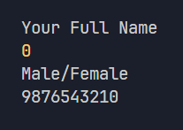
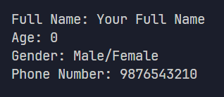

# TypeScript Practicals

A comprehensive collection of TypeScript exercises covering fundamental programming concepts, data structures, functions, and advanced features.

## Practical 1

Create variables named "fullName", "age", "gender", and "phoneNumber" with sample values.
Then display each variable's value in the console using console.log().

### Steps:

1. Create four variables to store personal information:
   - fullName: stores a person's full name
   - age: stores a person's age
   - gender: stores a person's gender
   - phoneNumber: stores a person's phone number

2. Display each variable's value in the console using console.log()
   This will print the values to the terminal when the program runs.

### Preview:

---

## Practical 2

Create variables named "fullName", "age", "gender", and "phoneNumber" with sample values.
Then display each variable's value in the console using template strings with descriptive labels.

### Steps:

1. Create four variables to store personal information:
   - fullName: stores a person's full name
   - age: stores a person's age
   - gender: stores a person's gender
   - phoneNumber: stores a person's phone number

2. Use template strings (backticks ``) to display each variable with a descriptive label
   Template strings allow you to embed variables directly using ${variableName}
   This will print formatted output like "Full Name: John Doe" to the terminal.

### Preview:

---

## Practical 3

Create an array named "userArray" to store personal information.
Store "fullName", "age", "gender", and "phoneNumber" in the array.
Then display each value using array indexing with template strings.

### Steps:

1. Create an array called userArray to store all personal information:
   - Index 0: stores the person's full name
   - Index 1: stores the person's age
   - Index 2: stores the person's gender
   - Index 3: stores the person's phone number

2. Access array elements using square brackets array[index]
   Arrays are zero-indexed, meaning the first element is at index 0

3. Use template strings to display each value with descriptive labels
   This will print formatted output like "Full Name: John Doe" to the terminal.

### Preview:

---

## Practical 4

Create an object named "userObject" to store personal information as key-value pairs.
Store "fullName", "age", "gender", and "phoneNumber" as properties of the object.
Then display each value using dot notation with template strings.

### Steps:

1. Create an object called userObject with properties:
   - fullName: stores the person's full name
   - age: stores the person's age
   - gender: stores the person's gender
   - phoneNumber: stores the person's phone number

2. Access object properties using dot notation (object.property)
   This is the most common way to access object properties in JavaScript/TypeScript

3. Use template strings to display each value with descriptive labels
   This will print formatted output like "Full Name: John Doe" to the terminal.

### Preview:

